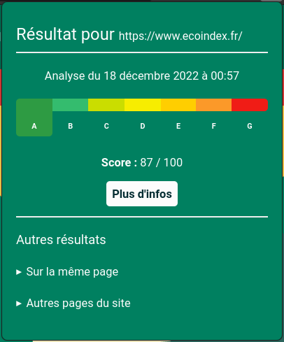
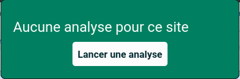
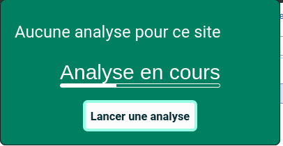
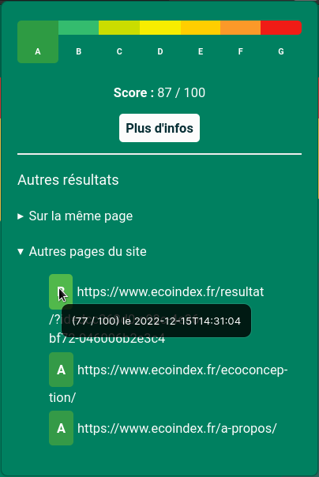

# Ecoindex browser plugin

This is the source code of the Ecoindex browser plugin.
This simple plugin allows you to check the Ecoindex of any website you visit.

This plugin is currently available for:


## Description

You can easily check the Ecoindex of any website you visit:



When there is no result, you will see a message, and you will be proposed to run an analysis:



When the analysis is running, you will see a message:



You can also dislplay older results existing for this page, or other results for the same domain:



## Development

Install dependencies and run firefox in development mode:

```bash
npm install
npm run start
```

Build the application:

```bash
npm build
```

## [Code of conduct](CODE_OF_CONDUCT.md)

## [License](LICENSE.md)
